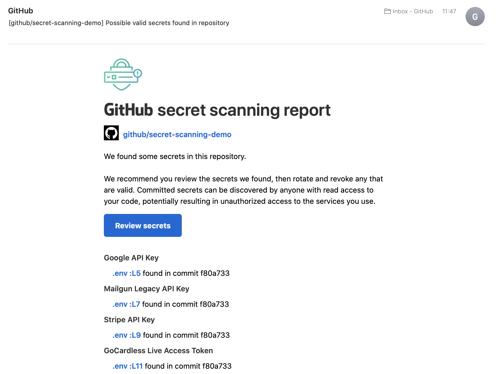

# Secret scanning demo repo
Demo repo showing the [secret scanning UI](https://github.com/github/secret-scanning-demo/security/secret-scanning). All GitHub employees are admins on this repo so they can see the UI.

**DO NOT COMMIT ANY MORE SECRETS TO THIS REPO UNLESS YOU WANT TO SPAM ALL OF GITHUB!!**

Currently (June 2020), we don't have a way to separate **permission** to view secret scanning alerts with **notifications** for every secret scanning alert. We're working on that. But in the meantime, please don't make any changes to this repo that would trigger new secret scanning finds.

If you need to add commits / do anything that might trigger security alerts, do the following:
1. Add yourself as an admin under [settings](https://github.com/github/secret-scanning-demo/settings/access)
2. Reduce the access level of the "Employees" team to "Read"
3. Make your changes
4. Increase the access level of "Employees" again

## Email notifications

The email associated with the secrets found in this repo (as at June 2020) is below.

